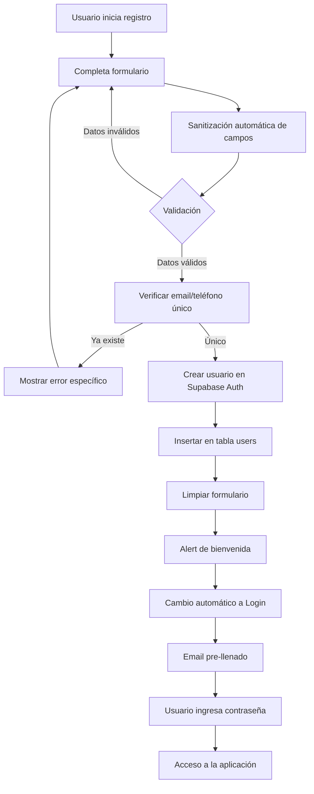
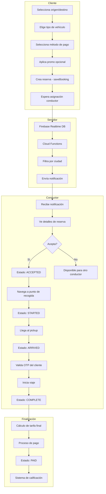

# T+Plus - Plataforma de Movilidad Inteligente 🚗

Aplicación móvil de transporte desarrollada con React Native, Expo y Supabase para conectar clientes con conductores de manera segura y eficiente.

## 📋 Tabla de Contenidos

- [Características Principales](#características-principales)
- [Tecnologías Utilizadas](#tecnologías-utilizadas)
- [Instalación](#instalación)
- [Esquemas de Base de Datos](#esquemas-de-base-de-datos)
- [Políticas de Seguridad (RLS)](#políticas-de-seguridad-rls)
- [Flujos de Usuario](#flujos-de-usuario)
- [Flujo Completo de Booking](#flujo-completo-de-booking)
- [Funciones Principales y Cruciales](#funciones-principales-y-cruciales)
- [Estado del Proyecto](#estado-del-proyecto)
- [Arquitectura](#arquitectura)
- [Configuración](#configuración)
- [Contribución](#contribución)

## ✨ Características Principales

### 🔐 Sistema de Autenticación
- Registro con validación en tiempo real
- Sanitización automática de inputs
- Verificación de correo electrónico
- Login con navegación inteligente según tipo de usuario
- Recuperación de contraseña

### 🚕 Sistema de Booking
- Creación de reservas con múltiples opciones de vehículos
- Seguimiento en tiempo real del conductor
- Chat integrado entre cliente y conductor
- Códigos OTP de seguridad
- Múltiples métodos de pago (Efectivo, Daviplata, Corporativo)
- Sistema de promociones y descuentos

### 👤 Perfiles de Usuario
- **Cliente**: Solicitar viajes, historial de reservas, métodos de pago
- **Conductor**: Aceptar/rechazar reservas, navegación GPS, gestión de ganancias
- **Empresa**: Dashboard corporativo para gestión de viajes empresariales

### 📱 Funcionalidades Adicionales
- Notificaciones push en tiempo real
- Compartir ubicación con contactos de seguridad
- Calificación y reseñas
- Historial de viajes
- Wallet digital

## 🛠️ Tecnologías Utilizadas

### Frontend
- **React Native** - Framework móvil
- **Expo SDK ~54.0.0** - Plataforma de desarrollo
- **TypeScript** - Tipado estático
- **Redux Toolkit** - Gestión de estado global
- **React Navigation** - Navegación entre pantallas

### Backend & Database
- **Supabase** - Backend as a Service
  - PostgreSQL database
  - Authentication
  - Real-time subscriptions
  - Storage
- **Firebase Realtime Database** - Chat y ubicación en tiempo real
- **Firebase Cloud Functions** - Notificaciones y lógica de servidor

### APIs & Servicios
- **Google Maps API** - Mapas y rutas
- **Expo Notifications** - Push notifications
- **Expo Haptics** - Feedback táctil
- **Axios** - Peticiones HTTP

## 📦 Instalación

1. **Clonar el repositorio**
   ```bash
   git clone <repository-url>
   cd masterchiefpar1
   ```

2. **Instalar dependencias**
   ```bash
   npm install
   ```

3. **Configurar variables de entorno**
   Crear archivo `config/keys.ts` con:
   ```typescript
   export const GOOGLE_MAPS_API_KEY = 'your_api_key';
   export const SUPABASE_URL = 'your_supabase_url';
   export const SUPABASE_ANON_KEY = 'your_supabase_key';
   ```

4. **Configurar Supabase**
   - Ejecutar scripts SQL en `sql/` para crear tablas
   - Configurar políticas RLS (ver sección de Políticas)
   - Habilitar Realtime en tabla `bookings`

5. **Iniciar el proyecto**
   ```bash
   npx expo start -c
   ```

6. **Ejecutar en dispositivo**
   - Escanea el QR con Expo Go (Android/iOS)
   - Presiona `a` para Android Emulator
   - Presiona `i` para iOS Simulator

## 🗄️ Esquemas de Base de Datos

### Tabla: `users`
Almacena perfiles de usuarios (clientes y conductores)

```sql
CREATE TABLE users (
  id UUID PRIMARY KEY DEFAULT uuid_generate_v4(),
  auth_id UUID REFERENCES auth.users(id) ON DELETE CASCADE,
  user_type TEXT NOT NULL CHECK (user_type IN ('customer', 'driver', 'company')),
  
  -- Datos personales
  first_name TEXT NOT NULL,
  last_name TEXT NOT NULL,
  email TEXT UNIQUE NOT NULL,
  mobile TEXT UNIQUE NOT NULL,
  profile_image TEXT,
  
  -- Verificación
  is_verified BOOLEAN DEFAULT false,
  email_verified BOOLEAN DEFAULT false,
  verify_id TEXT,
  verify_id_image TEXT,
  doc_type TEXT,
  
  -- Ubicación
  location JSONB, -- {latitude, longitude, heading}
  push_token TEXT,
  
  -- Configuración
  language TEXT DEFAULT 'es',
  approved BOOLEAN DEFAULT false,
  driver_active BOOLEAN DEFAULT false,
  queue BOOLEAN DEFAULT false,
  
  -- Datos financieros (conductor)
  bank_account TEXT,
  bank_code TEXT,
  bank_name TEXT,
  wallet_balance NUMERIC DEFAULT 0,
  
  -- Auditoría
  created_at TIMESTAMPTZ DEFAULT NOW(),
  updated_at TIMESTAMPTZ DEFAULT NOW()
);

-- Índices para optimización
CREATE INDEX idx_users_auth_id ON users(auth_id);
CREATE INDEX idx_users_email ON users(email);
CREATE INDEX idx_users_mobile ON users(mobile);
CREATE INDEX idx_users_user_type ON users(user_type);
CREATE INDEX idx_users_driver_active ON users(driver_active) WHERE user_type = 'driver';
```

### Tabla: `bookings`
Gestión de reservas y viajes

```sql
CREATE TABLE bookings (
  id UUID PRIMARY KEY DEFAULT uuid_generate_v4(),
  
  -- Referencias
  customer UUID REFERENCES users(id) ON DELETE CASCADE,
  driver UUID REFERENCES users(id) ON DELETE SET NULL,
  
  -- Estados compuestos (customer_id + status)
  customer_status TEXT, -- Compuesto: "customer_id_NEW"
  driver_status TEXT,   -- Compuesto: "driver_id_ACCEPTED"
  
  -- Ubicaciones
  pickup JSONB NOT NULL, -- {latitude, longitude, add: "dirección"}
  drop JSONB NOT NULL,
  
  -- Detalles del viaje
  car_type TEXT NOT NULL, -- TREAS-E, TREAS-X, TREAS-Van, TREAS-T
  trip_cost NUMERIC NOT NULL,
  trip_start_time TIMESTAMPTZ,
  trip_end_time TIMESTAMPTZ,
  total_time INTERVAL,
  distance NUMERIC, -- en metros
  
  -- Códigos de seguridad
  otp TEXT,
  otp_secure BOOLEAN DEFAULT false,
  
  -- Pago
  payment_mode TEXT DEFAULT 'cash', -- cash, daviplata, corporate
  payment_status TEXT DEFAULT 'pending', -- pending, processing, paid, failed
  transaction_id TEXT,
  promo_code TEXT,
  discount NUMERIC DEFAULT 0,
  driver_share NUMERIC, -- Ganancia del conductor
  
  -- Calificaciones
  rating NUMERIC CHECK (rating >= 1 AND rating <= 5),
  customer_rating NUMERIC,
  driver_rating NUMERIC,
  customer_review TEXT,
  driver_review TEXT,
  
  -- Estado del viaje
  status TEXT DEFAULT 'NEW', -- NEW, ACCEPTED, STARTED, ARRIVED, COMPLETE, PAID, CANCELLED
  cancel_reason TEXT,
  cancelled_by TEXT,
  
  -- Auditoría
  created_at TIMESTAMPTZ DEFAULT NOW(),
  updated_at TIMESTAMPTZ DEFAULT NOW()
);

-- Índices críticos para performance
CREATE INDEX idx_bookings_customer ON bookings(customer);
CREATE INDEX idx_bookings_driver ON bookings(driver);
CREATE INDEX idx_bookings_status ON bookings(status);
CREATE INDEX idx_bookings_customer_status ON bookings(customer_status);
CREATE INDEX idx_bookings_driver_status ON bookings(driver_status);
CREATE INDEX idx_bookings_created_at ON bookings(created_at DESC);

-- Índice compuesto para queries de conductores activos
CREATE INDEX idx_bookings_driver_active ON bookings(driver, status) 
WHERE status IN ('ACCEPTED', 'STARTED', 'ARRIVED');
```

### Tabla: `settings`
Configuración global de la aplicación

```sql
CREATE TABLE settings (
  id UUID PRIMARY KEY DEFAULT uuid_generate_v4(),
  
  -- Tarifas
  base_fare NUMERIC DEFAULT 4000,
  per_km_fare NUMERIC DEFAULT 1500,
  per_minute_fare NUMERIC DEFAULT 300,
  min_fare NUMERIC DEFAULT 5000,
  
  -- Comisiones
  platform_fee_percent NUMERIC DEFAULT 20, -- 20% comisión
  
  -- Configuración de OTP
  otp_enabled BOOLEAN DEFAULT true,
  otp_length INTEGER DEFAULT 4,
  
  -- Configuración de notificaciones
  notification_radius NUMERIC DEFAULT 5000, -- metros
  max_drivers_notified INTEGER DEFAULT 10,
  
  -- Otros
  cancellation_fee NUMERIC DEFAULT 2000,
  waiting_time_limit INTEGER DEFAULT 300, -- segundos
  
  updated_at TIMESTAMPTZ DEFAULT NOW()
);
```

### Tabla: `notifications`
Historial de notificaciones push

```sql
CREATE TABLE notifications (
  id UUID PRIMARY KEY DEFAULT uuid_generate_v4(),
  user_id UUID REFERENCES users(id) ON DELETE CASCADE,
  booking_id UUID REFERENCES bookings(id) ON DELETE CASCADE,
  
  title TEXT NOT NULL,
  body TEXT NOT NULL,
  data JSONB, -- Payload adicional
  
  notification_type TEXT, -- new_booking, booking_accepted, trip_started, etc.
  read BOOLEAN DEFAULT false,
  
  created_at TIMESTAMPTZ DEFAULT NOW()
);

CREATE INDEX idx_notifications_user_id ON notifications(user_id);
CREATE INDEX idx_notifications_read ON notifications(user_id, read);
```

## 🔒 Políticas de Seguridad (RLS)

### Políticas para tabla `users`

```sql
-- Habilitar RLS
ALTER TABLE users ENABLE ROW LEVEL SECURITY;

-- Los usuarios solo pueden leer su propio perfil
CREATE POLICY "Users can read own profile"
ON users FOR SELECT
USING (auth.uid() = auth_id);

-- Los usuarios pueden actualizar su propio perfil
CREATE POLICY "Users can update own profile"
ON users FOR UPDATE
USING (auth.uid() = auth_id)
WITH CHECK (auth.uid() = auth_id);

-- Permitir inserción durante registro (con auth_id correcto)
CREATE POLICY "Users can insert own profile"
ON users FOR INSERT
WITH CHECK (auth.uid() = auth_id);

-- Los conductores pueden ver otros conductores activos (para ubicación en mapa)
CREATE POLICY "Drivers can see active drivers"
ON users FOR SELECT
USING (
  user_type = 'driver' 
  AND driver_active = true
  AND EXISTS (
    SELECT 1 FROM users 
    WHERE auth_id = auth.uid() 
    AND user_type = 'driver'
  )
);
```

### Políticas para tabla `bookings`

```sql
-- Habilitar RLS
ALTER TABLE bookings ENABLE ROW LEVEL SECURITY;

-- Los clientes pueden ver sus propias reservas
CREATE POLICY "Customers can read own bookings"
ON bookings FOR SELECT
USING (
  customer IN (
    SELECT id FROM users WHERE auth_id = auth.uid()
  )
);

-- Los conductores pueden ver reservas asignadas a ellos
CREATE POLICY "Drivers can read assigned bookings"
ON bookings FOR SELECT
USING (
  driver IN (
    SELECT id FROM users WHERE auth_id = auth.uid()
  )
);

-- Los conductores activos pueden ver reservas nuevas en su ciudad
CREATE POLICY "Drivers can see new bookings"
ON bookings FOR SELECT
USING (
  status = 'NEW'
  AND EXISTS (
    SELECT 1 FROM users 
    WHERE auth_id = auth.uid() 
    AND user_type = 'driver'
    AND driver_active = true
  )
);

-- Los clientes pueden crear reservas
CREATE POLICY "Customers can create bookings"
ON bookings FOR INSERT
WITH CHECK (
  customer IN (
    SELECT id FROM users 
    WHERE auth_id = auth.uid() 
    AND user_type = 'customer'
  )
);

-- Los conductores pueden actualizar reservas asignadas
CREATE POLICY "Drivers can update assigned bookings"
ON bookings FOR UPDATE
USING (
  driver IN (
    SELECT id FROM users WHERE auth_id = auth.uid()
  )
)
WITH CHECK (
  driver IN (
    SELECT id FROM users WHERE auth_id = auth.uid()
  )
);

-- Los clientes pueden actualizar sus reservas (cancelar)
CREATE POLICY "Customers can update own bookings"
ON bookings FOR UPDATE
USING (
  customer IN (
    SELECT id FROM users WHERE auth_id = auth.uid()
  )
)
WITH CHECK (
  customer IN (
    SELECT id FROM users WHERE auth_id = auth.uid()
  )
);
```

### Políticas para tabla `settings`

```sql
-- Habilitar RLS
ALTER TABLE settings ENABLE ROW LEVEL SECURITY;

-- Todos los usuarios autenticados pueden leer configuración
CREATE POLICY "Authenticated users can read settings"
ON settings FOR SELECT
USING (auth.role() = 'authenticated');

-- Solo administradores pueden modificar (requiere custom claim)
CREATE POLICY "Only admins can update settings"
ON settings FOR UPDATE
USING (
  EXISTS (
    SELECT 1 FROM users 
    WHERE auth_id = auth.uid() 
    AND user_type = 'admin'
  )
);
```

### Políticas para tabla `notifications`

```sql
-- Habilitar RLS
ALTER TABLE notifications ENABLE ROW LEVEL SECURITY;

-- Los usuarios solo pueden ver sus propias notificaciones
CREATE POLICY "Users can read own notifications"
ON notifications FOR SELECT
USING (
  user_id IN (
    SELECT id FROM users WHERE auth_id = auth.uid()
  )
);

-- Los usuarios pueden marcar como leídas sus notificaciones
CREATE POLICY "Users can update own notifications"
ON notifications FOR UPDATE
USING (
  user_id IN (
    SELECT id FROM users WHERE auth_id = auth.uid()
  )
)
WITH CHECK (
  user_id IN (
    SELECT id FROM users WHERE auth_id = auth.uid()
  )
);
```

## 📱 Flujos de Usuario

### 🔑 Flujo de Registro



#### Sanitización de Campos
- **Email**: Espacios eliminados, lowercase, formato validado
- **Teléfono**: Solo dígitos, 10 caracteres
- **Nombres**: Caracteres especiales removidos, primera letra mayúscula
- **Validación en tiempo real** con debounce de 800ms

#### Post-Registro
1. ✅ Formulario limpiado automáticamente
2. ✅ Alert de bienvenida personalizado con nombre
3. ✅ Redirección automática a pantalla de login
4. ✅ Email pre-llenado para facilitar acceso
5. ✅ Logging detallado en consola para debugging

### 🚗 Flujo de Booking (Reserva de Viajes)



## 🔄 Flujo Completo de Booking

### Estados de la Reserva

```
┌─────────────────────────────────────────┐
│         RESERVA CREADA (NEW)            │
│  Cliente espera → Notificaciones enviadas│
└────────────────┬────────────────────────┘
                 │
                 ↓
┌─────────────────────────────────────────┐
│   CONDUCTOR ACEPTÓ (ACCEPTED)           │
│  Driver camino al pickup (5-15 min)     │
└────────────────┬────────────────────────┘
                 │
                 ↓
┌─────────────────────────────────────────┐
│      VIAJE INICIADO (STARTED/ARRIVED)   │
│  Driver pidió cliente → En ruta         │
└────────────────┬────────────────────────┘
                 │
                 ↓
┌─────────────────────────────────────────┐
│     VIAJE COMPLETADO (COMPLETE)         │
│  Destino alcanzado → Cálculo final      │
└────────────────┬────────────────────────┘
                 │
                 ↓
┌─────────────────────────────────────────┐
│         PAGO PROCESADO (PAID)           │
│  Transacción exitosa → Rating           │
└─────────────────────────────────────────┘
```

### Detalle de Cada Estado

#### 1️⃣ NEW (Reserva Creada)
**Archivo**: `common/actions/saveBooking.ts`

**Acciones**:
- ✅ Cliente selecciona origen/destino en mapa
- ✅ Cálculo de tarifa estimada con `FareCalculator.ts`
- ✅ Selección de tipo de vehículo (TREAS-E, TREAS-X, TREAS-Van, TREAS-T)
- ✅ Aplicación opcional de código promocional
- ✅ Generación de OTP de 4 dígitos para seguridad
- ✅ Guardado en Supabase tabla `bookings` con status = 'NEW'
- ✅ Creación de estados compuestos: `customer_status` = `{customer_id}_NEW`

**Notificaciones**:
- 📱 Cloud Function filtra conductores por ciudad y radio de 5km
- 📱 Envío de push notification a máximo 10 conductores activos
- 📱 Payload incluye detalles del viaje y tarifa estimada

**Campos críticos**:
```typescript
{
  customer: user.id,
  pickup: { latitude, longitude, add: "dirección" },
  drop: { latitude, longitude, add: "dirección" },
  car_type: "TREAS-X",
  trip_cost: 15000,
  otp: "1234",
  status: "NEW",
  customer_status: "customer_uuid_NEW"
}
```

#### 2️⃣ ACCEPTED (Conductor Aceptó)
**Archivo**: `app/(tabs)/index.tsx` (Driver Map)

**Acciones**:
- ✅ Conductor presiona botón "Aceptar" en modal de reserva
- ✅ Update a Supabase:
  ```typescript
  {
    driver: driver.id,
    status: "ACCEPTED",
    driver_status: "{driver_id}_ACCEPTED",
    customer_status: "{customer_id}_ACCEPTED"
  }
  ```
- ✅ Notificación al cliente: "Tu conductor viene en camino"
- ✅ Inicio de tracking de ubicación en tiempo real
- ✅ Cálculo de ETA (tiempo estimado de llegada) al punto de recogida

**UI Cliente** (`app/Booking/BookingCabScreen.tsx`):
- 🗺️ Mapa con marcador del conductor moviéndose en tiempo real
- ⏱️ Contador de tiempo estimado de llegada
- 📞 Botones de llamar/chat con conductor
- ℹ️ Detalles del conductor: nombre, foto, placa, modelo del vehículo

#### 3️⃣ STARTED (Viaje Iniciado)
**Acciones**:
- ✅ Conductor presiona "Recoger pasajero"
- ✅ Validación opcional de OTP del cliente
- ✅ Update: `status = "STARTED"`, `trip_start_time = NOW()`
- ✅ Inicio de cálculo de distancia recorrida
- ✅ Navegación GPS activada con Google Maps Directions

**Funcionalidades activas**:
- 📍 Tracking continuo de ubicación cada 10 segundos
- 💬 Chat en tiempo real (Firebase Realtime Database)
- 🚨 Botón de compartir ubicación con contactos de emergencia
- ⏱️ Cronómetro de duración del viaje

#### 4️⃣ ARRIVED (Llegó al Destino)
**Acciones**:
- ✅ Conductor presiona "Finalizar viaje"
- ✅ Cálculo final de tarifa basado en:
  - Distancia real recorrida × tarifa por km
  - Tiempo real transcurrido × tarifa por minuto
  - Tarifa base
  - Descuento de código promocional (si aplica)
- ✅ Update: `status = "COMPLETE"`, `trip_end_time = NOW()`
- ✅ Cálculo de comisión de plataforma (20% default)

**Fórmula de cálculo**:
```typescript
const baseFare = settings.base_fare; // 4000
const kmFare = distance_km * settings.per_km_fare; // 1500/km
const timeFare = minutes * settings.per_minute_fare; // 300/min
const subtotal = baseFare + kmFare + timeFare;
const discount = promo_code ? (subtotal * promo.percentage / 100) : 0;
const total = Math.max(subtotal - discount, settings.min_fare); // Mínimo 5000
const platformFee = total * 0.20;
const driverShare = total - platformFee;
```

#### 5️⃣ COMPLETE (Viaje Completado)
**Acciones**:
- ✅ Presentación de resumen del viaje
- ✅ Desglose de costos:
  - Tarifa base
  - Costo por distancia
  - Costo por tiempo
  - Descuentos aplicados
  - **Total a pagar**

**Pantalla**: `app/(tabs)/PaymentDetails.tsx`
- 🧾 Recibo detallado
- 💳 Confirmación de método de pago
- 📧 Opción de enviar recibo por email

#### 6️⃣ PAID (Pago Procesado)
**Métodos de pago soportados**:

1. **Efectivo** (`payment_mode: 'cash'`)
   - Cliente paga directamente al conductor
   - Conductor confirma recepción en app
   - Status: `payment_status = 'paid'`

2. **Daviplata** (`payment_mode: 'daviplata'`)
   - **Archivo**: `app/Daviplata/Daviplata.tsx`
   - Integración con API de Daviplata
   - Generación de código OTP para validación
   - Webhook de confirmación de pago
   - Status actualizado automáticamente

3. **Corporativo** (`payment_mode: 'corporate'`)
   - Empresas con cuenta prepagada
   - Descuento automático del saldo corporativo
   - Facturación mensual

**Post-Pago**:
- ⭐ Sistema de calificación mutua (1-5 estrellas)
- 💬 Comentarios opcionales
- 🏆 Actualización de rating promedio del conductor
- 💰 Actualización de wallet del conductor
- 📊 Registro en historial de viajes

### Componentes Clave del Booking

**BookingScreen.tsx** (`app/(tabs)/BookingScreen.tsx`)
- Selección de rutas con Google Maps
- Cálculo de tarifas en tiempo real
- Interfaz de selección de vehículos
- Aplicación de promociones
- Selección de método de pago

**BookingCabScreen.tsx** (`app/Booking/BookingCabScren.tsx`)
- Mapa en tiempo real con ubicación del conductor
- Chat integrado
- Sistema de llamadas
- Botones de acción según estado
- Compartir ubicación
- Reportar incidentes

**ActiveBookingScreen.tsx** (`app/Booking/ActiveBookingScreen.tsx`)
- Historial de reservas
- Filtros por estado
- Acciones de aceptar/rechazar
- Detalles de cada reserva

## ⚙️ Funciones Principales y Cruciales

### 🔑 Autenticación (Supabase Auth)

#### `common/actions/authactions.tsx`
Acciones Redux para gestión de autenticación

**Funciones críticas**:
```typescript
// Login con Supabase
export const loginUser = (email: string, password: string)
- Sanitización de email (toLowerCase, trim)
- supabase.auth.signInWithPassword()
- Dispatch de setUser + setProfile
- Navegación automática según user_type

// Registro de usuario
export const signupUser = (userData: UserData)
- Validación de campos únicos (email/teléfono)
- Creación en Supabase Auth
- Inserción en tabla users con auth_id
- Limpieza automática de formulario
- Pre-llenado de email en pantalla de login

// Actualizar perfil
export const updateProfile = (updates: Partial<User>)
- Update en tabla users WHERE auth_id = current_user
- Merge con estado actual de Redux
- Hidratación de campos legacy (usertype from user_type)

// Actualizar ubicación (migrado de Firebase)
export const updateUserLocation = (location: Location)
- Obtención de sesión activa de Supabase
- Update en columna location (JSONB)
- Usado para tracking de conductores

// Actualizar push token (migrado de Firebase)
export const updatePushToken = (token: string)
- Update en columna push_token
- Requerido para notificaciones de nuevas reservas
```

**Archivo de validación**: `common/services/ValidationService.ts`
```typescript
// Validar email único contra Supabase
checkEmailExists(email: string): Promise<boolean>
- Query: SELECT 1 FROM users WHERE email = $1 LIMIT 1
- Timeout: 8000ms
- Retry automático en error de red

// Validar teléfono único
checkPhoneExists(phone: string): Promise<boolean>
- Query: SELECT 1 FROM users WHERE mobile = $1 LIMIT 1
- Formateo: elimina espacios y caracteres especiales
```

**Hooks de validación**: `hooks/useEmailValidation.ts`, `hooks/usePhoneValidation.ts`
- Debounce de 800ms para evitar múltiples llamadas
- Indicadores de loading en tiempo real
- Mensajes de error específicos en UI
- **Deshabilitados en modo login** (solo activos en registro)

### 📍Sistema de Mapas

#### `app/(tabs)/CustomerMap.tsx` - Mapa del Cliente
**Funcionalidades**:
```typescript
// Autocompletado de direcciones con Google Places
<GooglePlacesAutocomplete
  nearbyPlacesAPI="GooglePlacesSearch"
  debounce={400}
  sessionToken // Reduce costos de API
/>

// Tracking de ubicación en tiempo real
Location.watchPositionAsync({
  accuracy: Location.Accuracy.High,
  timeInterval: 10000,
  distanceInterval: 50
})

// Consultar reservas activas desde Supabase
const statuses = ['ACCEPTED', 'REACHED', 'NEW', 'STARTED', 'ARRIVED'];
const compositeStatuses = statuses.map(s => `${user.id}_${s}`);
const { count } = await supabase
  .from('bookings')
  .select('id', { count: 'exact', head: true })
  .eq('customer', user.id)
  .in('customer_status', compositeStatuses);
```

#### `app/(tabs)/index.tsx` - Mapa del Conductor
**Funcionalidades**:
```typescript
// Escuchar nuevas reservas (PENDIENTE MIGRAR A SUPABASE)
// Actualmente usa Firebase Realtime Database
firebase.database().ref('bookings')
  .orderByChild('status')
  .equalTo('NEW')
  .on('child_added', handleNewBooking);

// Aceptar reserva
const acceptBooking = async (bookingId: string) => {
  await supabase.from('bookings').update({
    driver: driver.id,
    status: 'ACCEPTED',
    driver_status: `${driver.id}_ACCEPTED`,
    customer_status: `${customer.id}_ACCEPTED`
  }).eq('id', bookingId);
}

// Actualizar estado del conductor (activo/inactivo)
const toggleDriverStatus = async () => {
  await supabase.from('users').update({
    driver_active: !currentStatus
  }).eq('auth_id', auth.uid());
}
```

### 💳 Sistema de Pagos

#### `app/Daviplata/Daviplata.tsx` - Integración Daviplata
**Flujo completo**:
```typescript
// 1. Iniciar transacción
const initiatePayment = async (amount: number, phone: string) => {
  const response = await axios.post(DAVIPLATA_API, {
    amount,
    phone,
    reference: bookingId
  });
  return response.data.otp_id;
}

// 2. Enviar OTP al cliente
const sendOTP = async (otpId: string) => {
  // SMS enviado por Daviplata
  setOtpModalVisible(true);
}

// 3. Validar OTP
const validateOTP = async (otp: string) => {
  const response = await axios.post(DAVIPLATA_VALIDATE, {
    otp_id: otpId,
    otp: otp
  });
  
  if (response.data.success) {
    // Actualizar booking
    await supabase.from('bookings').update({
      payment_status: 'paid',
      status: 'PAID',
      transaction_id: response.data.transaction_id
    }).eq('id', bookingId);
  }
}
```

#### `common/actions/FareCalculator.ts` - Cálculo de Tarifas
**Algoritmo**:
```typescript
export const calculateFare = (
  distance: number, // metros
  duration: number, // segundos
  carType: string,
  settings: Settings
) => {
  const distanceKm = distance / 1000;
  const durationMin = duration / 60;
  
  // Tarifa base según tipo de vehículo
  const baseMultipliers = {
    'TREAS-E': 1.0,
    'TREAS-X': 1.2,
    'TREAS-Van': 1.5,
    'TREAS-T': 0.9
  };
  
  const baseFare = settings.base_fare * baseMultipliers[carType];
  const distanceFare = distanceKm * settings.per_km_fare;
  const timeFare = durationMin * settings.per_minute_fare;
  
  const subtotal = baseFare + distanceFare + timeFare;
  return Math.max(subtotal, settings.min_fare);
}
```

### 📊 Gestión de Estado (Redux)

#### `common/reducers/authReducer.tsx` - Estado de Auth
**Acciones críticas**:
```typescript
// setUser - Usuario de Supabase Auth
case 'setUser':
  return {
    ...state,
    user: action.payload,
    isLoggedIn: true
  };

// setProfile - Perfil de tabla users con hidratación legacy
case 'setProfile':
  return {
    ...state,
    profile: action.payload,
    user: {
      ...state.user,
      // Hidratar campos legacy para compatibilidad
      usertype: action.payload.user_type,
      emailVerified: Boolean(action.payload.is_verified),
      verifyIdImage: action.payload.verify_id_image
    }
  };
```

**Problema resuelto**: App originalmente usaba Firebase con `user.usertype`, pero Supabase usa `profile.user_type`. La hidratación en el reducer asegura compatibilidad backward.

#### `common/store/bookingsSlice.ts` - Estado de Reservas
**Thunks asíncronos**:
```typescript
// Crear nueva reserva
export const createBooking = createAsyncThunk(
  'bookings/create',
  async (bookingData: BookingData, { getState }) => {
    const { customer } = getState().auth.user;
    
    const booking = {
      ...bookingData,
      customer: customer.id,
      otp: generateOTP(4),
      status: 'NEW',
      customer_status: `${customer.id}_NEW`,
      created_at: new Date().toISOString()
    };
    
    const { data, error } = await supabase
      .from('bookings')
      .insert(booking)
      .select()
      .single();
    
    if (error) throw error;
    
    // Trigger notification function
    await triggerDriverNotifications(data.id);
    
    return data;
  }
);

// Actualizar estado de reserva
export const updateBookingStatus = createAsyncThunk(
  'bookings/updateStatus',
  async ({ bookingId, status }: UpdateStatusPayload) => {
    const updates = {
      status,
      updated_at: new Date().toISOString()
    };
    
    if (status === 'STARTED') {
      updates.trip_start_time = new Date().toISOString();
    } else if (status === 'COMPLETE') {
      updates.trip_end_time = new Date().toISOString();
    }
    
    const { data, error } = await supabase
      .from('bookings')
      .update(updates)
      .eq('id', bookingId)
      .select()
      .single();
    
    if (error) throw error;
    return data;
  }
);
```

### 🔔 Sistema de Notificaciones

#### `hooks/NotificationService.tsx`
**Configuración**:
```typescript
// Registrar token push
const registerForPushNotifications = async () => {
  const { status } = await Notifications.requestPermissionsAsync();
  
  if (status !== 'granted') {
    Alert.alert('Notificaciones deshabilitadas');
    return;
  }
  
  const token = (await Notifications.getExpoPushTokenAsync()).data;
  
  // Guardar en Supabase
  await dispatch(updatePushToken(token));
}

// Listener de notificaciones en primer plano
Notifications.addNotificationReceivedListener((notification) => {
  const { bookingId, type } = notification.request.content.data;
  
  if (type === 'new_booking') {
    // Mostrar modal de nueva reserva
    dispatch(loadBookingDetails(bookingId));
  } else if (type === 'booking_accepted') {
    // Navegar a pantalla de viaje activo
    navigation.navigate('BookingCabScreen', { bookingId });
  }
});
```

**Firebase Cloud Function** (`functions/index.ts`):
```typescript
// Trigger al crear nueva reserva
export const onBookingCreated = functions.database
  .ref('/bookings/{bookingId}')
  .onCreate(async (snapshot, context) => {
    const booking = snapshot.val();
    
    // Query conductores activos en la ciudad
    const { data: drivers } = await supabase
      .from('users')
      .select('push_token, location')
      .eq('user_type', 'driver')
      .eq('driver_active', true)
      .eq('city', booking.pickup.city);
    
    // Filtrar por distancia (radio de 5km)
    const nearbyDrivers = drivers.filter(driver => {
      const distance = calculateDistance(
        booking.pickup.latitude,
        booking.pickup.longitude,
        driver.location.latitude,
        driver.location.longitude
      );
      return distance <= 5000; // 5km
    });
    
    // Enviar notificaciones push
    const messages = nearbyDrivers.slice(0, 10).map(driver => ({
      to: driver.push_token,
      sound: 'default',
      title: '🚗 Nueva reserva disponible',
      body: `${booking.pickup.add} → ${booking.drop.add}`,
      data: {
        bookingId: context.params.bookingId,
        type: 'new_booking',
        estimatedFare: booking.trip_cost
      }
    }));
    
    await expo.sendPushNotificationsAsync(messages);
  });
```

## 📈 Estado del Proyecto

### ✅ Funcionalidades Completadas

#### Autenticación
- ✅ Registro con Supabase Auth
- ✅ Login con validación de email/password
- ✅ Sanitización automática de inputs
- ✅ Validación única de email/teléfono en tiempo real
- ✅ Deduplicación de llamadas a fetch de perfil
- ✅ Navegación inteligente según `user_type`
- ✅ Hidratación de campos legacy en Redux
- ✅ Logout y limpieza de sesión

#### Mapas
- ✅ Integración con Google Maps
- ✅ Autocompletado de direcciones con Places API
- ✅ Tracking de ubicación en tiempo real
- ✅ Visualización de conductores cercanos
- ✅ Cálculo de rutas con Directions API
- ✅ Migraciones críticas de Firebase → Supabase:
  - ✅ `updateUserLocation` ahora usa Supabase
  - ✅ `updatePushToken` ahora usa Supabase
  - ✅ Query de reservas activas usa Supabase con `customer_status`

#### Bookings
- ✅ Creación de reservas con `saveBooking.ts`
- ✅ Cálculo de tarifas con múltiples factores
- ✅ Generación de OTP para seguridad
- ✅ Selección de tipo de vehículo
- ✅ Aplicación de códigos promocionales
- ✅ Estados compuestos (`customer_status`, `driver_status`)
- ✅ Actualización de estados en tiempo real

#### Pagos
- ✅ Pago en efectivo
- ✅ Integración con Daviplata (OTP, validación)
- ✅ Cálculo de comisiones de plataforma
- ✅ Desglose detallado de costos
- ✅ Recibo digital

#### UI/UX
- ✅ Modo oscuro/claro automático
- ✅ Animaciones con Animatable
- ✅ Feedback háptico en acciones críticas
- ✅ Indicadores de carga
- ✅ Manejo de errores con Alerts
- ✅ Bypass temporal de verificación de email (desarrollo)

### ⚠️ Funcionalidades Pendientes

#### Migraciones Firebase → Supabase
- ❌ **Driver Map** (`app/(tabs)/index.tsx`):
  - Listener de nuevas reservas aún usa Firebase Realtime
  - Query de `checks` aún usa Firebase
  - Necesita migrar a Supabase Realtime Subscriptions
  
- ❌ **Chat en tiempo real**:
  - Actualmente usa Firebase Realtime Database
  - Migrar a Supabase Realtime channels

- ❌ **Cloud Functions**:
  - `onBookingCreated` trigger en Firebase
  - Migrar a Supabase Edge Functions o Webhooks

#### Verificación de Email
- ❌ Configurar URLs de verificación en Supabase Dashboard
- ❌ Email templates personalizados
- ❌ Re-habilitar validación de `emailVerified` en:
  - `CustomerMap.tsx` (línea 127)
  - `index.tsx` (línea 301)
  - `ChecksData.tsx` (línea 11)

#### Sistema de Rating
- ❌ Interfaz de calificación post-viaje
- ❌ Guardar ratings en tabla `bookings`
- ❌ Calcular promedio de rating por conductor
- ❌ Mostrar rating en perfil de conductor

#### Wallet Digital
- ✅ Estructura de base de datos (`wallet_balance` en `users`)
- ❌ Pantalla de historial de transacciones
- ❌ Sistema de retiros para conductores
- ❌ Recarga de saldo corporativo

#### Seguridad
- ❌ Implementar rate limiting en validaciones de email/teléfono
- ❌ Encriptar datos sensibles en tránsito (ya protegido por HTTPS)
- ❌ Auditoría de logs de acciones críticas
- ❌ 2FA opcional para conductores

#### Analytics
- ❌ Integración con Firebase Analytics o Mixpanel
- ❌ Tracking de eventos críticos:
  - Booking creado
  - Booking aceptado
  - Viaje completado
  - Abandono en flujo de reserva
- ❌ Dashboard de métricas en tiempo real

### 🐛 Problemas Conocidos

#### Críticos
- 🔴 **Firebase Realtime queries en driver map**: Bloquean migración completa a Supabase
- 🔴 **Email verification deshabilitado**: Compromiso de seguridad temporal

#### Moderados
- 🟡 **Expo Notifications en Expo Go**: No soporta notificaciones remotas en SDK 53
  - Workaround: Solo funciona en builds EAS
- 🟡 **Session tokens de Google Places**: Pueden acumular costos si no se gestionan bien
  - Mitigation: Usar `sessionToken` ref en Autocomplete

#### Menores
- 🟢 **Validación de teléfono timeout**: A veces excede 8s en redes lentas
  - Solución: Aumentar timeout o implementar retry con backoff
- 🟢 **Double profile fetch**: Mitigado con deduplicación en `userActions.ts`, pero puede optimizarse más

### 🎯 Próximos Pasos (Roadmap)

#### Sprint 1 - Migración Completa a Supabase
1. Migrar listener de reservas en driver map a Supabase Realtime
2. Migrar chat a Supabase Realtime channels
3. Implementar Edge Functions para notificaciones
4. Eliminar dependencias de Firebase Realtime Database

#### Sprint 2 - Verificación y Seguridad
1. Configurar email verification con URLs correctas
2. Re-habilitar validaciones de email en pantallas
3. Implementar 2FA para conductores
4. Auditoría de seguridad completa

#### Sprint 3 - Features de Usuario
1. Sistema de rating bidireccional
2. Historial de transacciones en wallet
3. Sistema de retiros para conductores
4. Recargas corporativas

#### Sprint 4 - Analytics y Optimización
1. Integrar analytics
2. Optimizar queries de Supabase con índices
3. Implementar caché local con AsyncStorage
4. Performance profiling y mejoras

### 📊 Métricas de Código

```
Total de archivos TypeScript: ~150
Líneas de código: ~25,000
Componentes React: ~45
Redux slices: 5
Pantallas principales: 20+
APIs integradas: 3 (Google Maps, Supabase, Daviplata)
```


## 📂 Arquitectura del Proyecto

```
masterchiefpar1/
├── app/                          # Navegación basada en archivos
│   ├── (tabs)/                   # Pantallas con TabNavigator
│   │   ├── index.tsx             # Home/Dashboard
│   │   ├── BookingScreen.tsx     # Crear nueva reserva
│   │   ├── PaymentDetails.tsx    # Pago y recibo
│   │   └── ...
│   ├── Booking/                  # Módulo de reservas
│   │   ├── BookingCabScren.tsx   # Vista de viaje activo
│   │   ├── ActiveBookingScreen.tsx # Historial
│   │   └── NavigationWebView.tsx
│   ├── login/                    # Autenticación
│   │   ├── LoginScreen.tsx       # Login/Registro
│   │   └── PreLogin.tsx          # Splash screen
│   └── _layout.tsx               # Layout raíz
├── common/                       # Lógica compartida
│   ├── actions/                  # Redux actions
│   │   ├── saveBooking.ts        # Crear reserva
│   │   └── FareCalculator.ts     # Cálculo de tarifas
│   ├── store/                    # Redux store
│   │   ├── bookingsSlice.ts      # Estado de bookings
│   │   └── store.ts              # Configuración store
│   ├── services/                 # Servicios externos
│   │   └── ValidationService.ts
│   └── utils/                    # Utilidades
│       └── validators.ts         # Validación de campos
├── components/                   # Componentes reutilizables
│   ├── OtpModal.tsx              # Modal OTP
│   ├── CancelModal.tsx           # Cancelar reserva
│   └── BookingsView.tsx          # Lista de reservas
├── config/                       # Configuración
│   ├── SupabaseConfig.ts         # Cliente Supabase
│   └── AppConfig.ts              # Variables globales
├── hooks/                        # Custom hooks
│   ├── useEmailValidation.ts     # Validar email
│   └── usePhoneValidation.ts     # Validar teléfono
└── functions/                    # Cloud Functions
    └── index.ts                  # Firebase Functions
```

## 🔧 Configuración

### Configurar Supabase

1. Crear proyecto en [supabase.com](https://supabase.com)
2. Ejecutar SQL de esquema (ver `sql/user-registration-setup.sql`)
3. Configurar políticas RLS (Row Level Security)
4. Actualizar variables en `config/SupabaseConfig.ts`


### Configurar Google Maps

1. Obtener API Key de [Google Cloud Console](https://console.cloud.google.com)
2. Habilitar APIs:
   - Maps SDK for Android
   - Maps SDK for iOS
   - Directions API
   - Distance Matrix API
3. Actualizar en `config/AppConfig.ts`

## 🔐 Variables de Entorno

Archivo `config/keys.ts`:
```typescript
export const API_KEY = 'GOOGLE_MAPS_API_KEY';
export const SUPABASE_URL = 'YOUR_SUPABASE_URL';
export const SUPABASE_ANON_KEY = 'YOUR_SUPABASE_ANON_KEY';
export const FIREBASE_CONFIG = {
  apiKey: "...",
  authDomain: "...",
  projectId: "...",
  // ...
};
```

## 🧪 Testing

```bash
# Ejecutar tests
npm test

# Test con coverage
npm run test:coverage
```

## 🚀 Build & Deploy

### Android
```bash
# Build APK
eas build --platform android --profile preview

# Build AAB para Play Store
eas build --platform android --profile production
```

### iOS
```bash
# Build para simulador
eas build --platform ios --profile preview

# Build para App Store
eas build --platform ios --profile production
```

## 📝 Contribución

1. Fork del proyecto
2. Crear branch de feature (`git checkout -b feature/AmazingFeature`)
3. Commit cambios (`git commit -m 'Add AmazingFeature'`)
4. Push al branch (`git push origin feature/AmazingFeature`)
5. Abrir Pull Request


**Versión**: 2.0  
**Última actualización**: Marzo 2026  
**Compatible con**: Expo SDK ~54.0.0, React Native 0.76.5
